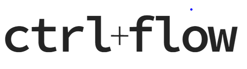

  

ctrlflow is an **app development framework** for no-code process automation that reimagines the standard approach used by no-code platforms. It empowers engineers to easily develop and support no-code experiences custom-tailored to your organization, without compromising on process or tooling. It aims to ease no-code adoption for orgs small and large, while making it easy to move complexity into full-code as solutions mature.

## Early Development

blablabla

## Getting Started

ctrlflow is added to existing or new applications as an npm package.

`npm install @ctrlflow/core`

Out of the box, it provides a workflow editor UI and a workflow execution runtime. Developers simply describe components like actions and events in code that they want to make available to users, and ctrlflow automatically populates them in the UI. Components can also be added from third party packages.

The workflow editor comes in two forms:

1) An admin-style dashboard, where users can author and search for automation definitions, or review executions of these instances. This is an experience similar to what most SaaS no-code platforms provide.
2) The automation workflow editor also ~~is~~ will be available as a standalone UI component that can be embedded into any web application. This will let you deliver the ability for users to describe automated processes within a specific context, with the option to limit the actions and events that are available to use in that context. This component also integrates automatically with the backend execution runtime.

The framework requires a message scheduling provider and persistent storage. At the moment the only supported provider is Redis, though others may be supported later.

## License
